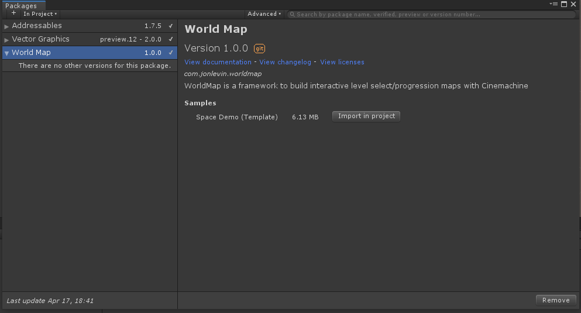

# WorldMap
[](https://github.com/jonlevin25/WorldMap/blob/master/LICENSE)
[](https://openupm.com/packages/com.jonlevin.worldmap/)

World Map is a plugin for creating 3D level-select / progression maps in Unity

<a href="http://www.youtube.com/watch?feature=player_embedded&v=H9xcQNLpf4w" target="_blank">
Demo<br />
</a>

## Installing with openupm
This package is available on the [openupm registry](https://openupm.com). You can install it via [openupm-cli](https://github.com/openupm/openupm-cli).
```
openupm add com.jonlevin.worldmap
```

## Install via manifest.json (git url)
Alternatively, you can also install by manually modifying your **manifest.json**:<br />

1. Add the package to the 'dependencies' section:
```
"com.jonlevin.worldmap": "git+https://github.com/JonLevin25/WorldMap.git#upm"
```

2. add this section enable the project's dependencies (insert before or after the 'dependencies' section)
```
    "scopedRegistries": [
        {
          "name": "package.openupm.com",
          "url": "https://package.openupm.com",
          "scopes": [
            "com.dbrizov.naughtyattributes",
            "com.openupm"
          ]
        }
    ]
```

if your manifest cannot be parsed - [make sure its valid](https://jsonlint.com/), then make sure the `scopedRegistries` are within the root curly braces, but not nested in anything else.

## Setting up the demo scene

WorldMap comes with a demo scene that can be used as a template.<br />
To load it (after installing the package):

1. Open the Package manager (In the menu bar: Window/Package Manager)
2. Find the WorldMap package (make sure filter is set to  "All Packages" or "In Project" )<br />
It should look something like this:<br />


3. Find the demo scene sample, and click "Import in project" 
4. Unity should import the sample to `Assets/Samples/<version>/Space Demo`
5. The demo scene should be in that directory


## Versioning

[SemVer](http://semver.org/) for versioning. For the versions available, see the [tags on this repository](https://github.com/JonLevin25/WorldMap/tags). 


## Acknowledgments

* [dbrizov/NaughtyAttributes](https://github.com/dbrizov/NaughtyAttributes/) -  used for custom inspectors, repo used as template for github ci + parts of readme
* openUPM - free platform for hosting / distributing upm packages

